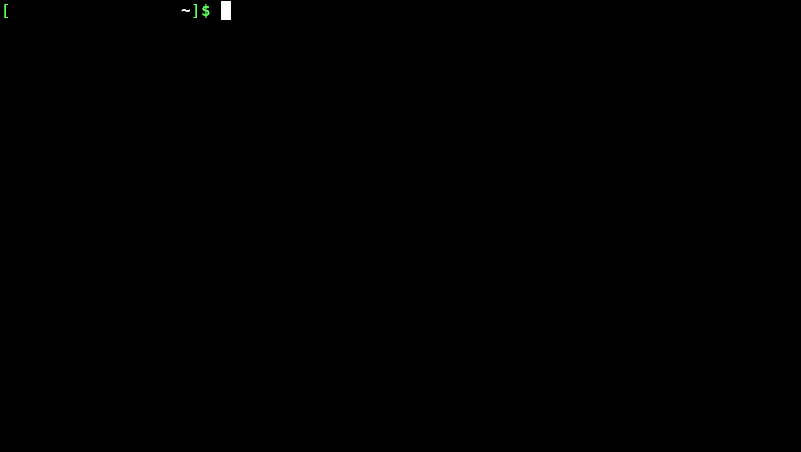

# DeviantArt Scraper

The easy way to download the highest resolution DeviantArt Galleries. For more information check this [article](https://mlvnt.com/blog/tech/scraping-deviantart/).



## Requirements

**1. Install python dependencies:**

```
pip install -r requirements.txt
```

**2. Install Chromium:**

- Debian Based

    ```
    sudo apt install chromium-browser
    ```

- Arch

    ```
    sudo pacman -S chromium
    ```

## Run

**1.** Replace on line *54* **username** with the username of your preferred artist:

```
54   d.get('https://username.deviantart.com/gallery/')
```

**2.** Run

```
python3 deviantart.py
```

**3.** You'll end up with a text file containing the image URLs and a folder with all the downloaded images

```
<username>-gallery.txt
<username>.deviantart.com/
```

## License

The code is licensed under The GNU Affero General Public License v3 (GNU AGPL)

> Disclaimer: All art you download using this script belongs to their rightful owners. Please support them by purchasing their art.
